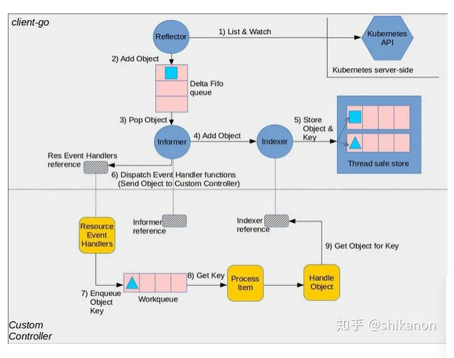
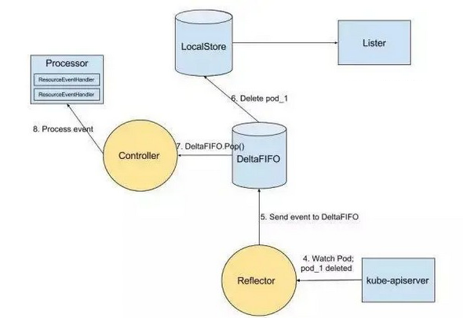

### CR定义及代码生成

1、需要实现pkg/apis/foperator.test/v1alpha1/types.go、pkg/apis/foperator.test/v1alpha1/register.go

2、clientset、informer、lister代码生成参考：https://www.jianshu.com/p/861924c20535

3、controller文件编写，自定义实现operators.Informer().AddEventHandler

常见问题：

1、执行命令报错：未安装git类似错误，推荐使用较低版本的code-generator

### CRD创建

SCC后台执行以下命令： kubectl apply -f ./config/resource/CRD.yaml

### SCC后台运行controller

1、从KM上copy kubeconfig粘贴到同目录的kubeconfig文件中

2、直接执行myoperator

### POD运行controller(当前不可用，待修正)
1、创建ClusterRole、ServiceAccount、ClusterRoleBinding等资源:

kubectl apply -f ./resource/ClusterRole.yaml
kubectl apply -f ./resource/ServiceAccount.yaml
kubectl apply -f ./resource/ClusterRoleBinding.yaml

2、创建对应的controller， 替换pod的yaml文件中的serviceaccount的secret
kubectl apply -f ./resource/ControllerPod.yaml

执行以下命令看到 READY 为 1/1 后 Ctrl+C 结束
kubectl get pod -n fns mycontroller -w

进入容器
kubectl exec -n fns mycontroller -it -- bash

### 创建自定义资源

kubectl apply -f ./config/resource/sample-operator.yaml

## Operator 原理

cient-go 是从 k8s 代码中抽出来的一个客户端工具，Informer 是 client-go 中的核心工具包，Informer是一个带有本地缓存和索引机制的、可以注册 EventHandler的client，本地缓存被称为Store，索引被称为Index。

1、Informer 通过Refector包的List/Watch实现，Informer启动后通过List获取当前apiserver的某种资源全部object，运行时通过watch监听上述object变更，

2、将watch到的事件写入到Delta FIFO（增量先进先出队列）

3、Informer从Delta FIFO读取事件对象，并写入到本地缓存中，同时触发预先注册好的事件处理函数。

4、事件处理函数将事件对象写入到工作队列，有其他按需协程处理

### List/Watch机制原理

list-watch有两部分组成，分别是list和watch。list就是调用资源的list API罗列资源，基于HTTP短链接实现；watch则是调用资源的watch API监听资源变更事件，基于HTTP 长链接实现

List及普通的http请求，一次性返回所有执行类型的资源。

Watch需要长时间获取资源的变更事件，Watch是通过HTTP 长链接接收apiserver发来的资源变更事件。HTTP 长链接主要通过Chunked transfer encoding(分块传输编码)技术。客户端调用watch API时，apiserver 在response的HTTP Header中设置Transfer-Encoding的值为chunked，表示采用分块传输编码，客户端收到该信息后，便和服务端该链接，并等待下一个数据块，即资源的事件信息

#### 分块传输编码

HTTP 分块传输编码允许服务器为动态生成的内容维持 HTTP 持久链接。通常，持久链接需要服务器在开始发送消息体前发送Content-Length消息头字段，但是对于动态生成的内容来说，在内容创建完之前是不可知的。使用分块传输编码，数据分解成一系列数据块，并以一个或多个块发送，这样服务器可以发送数据而不需要预先知道发送内容的总大小。

#### List/Watch机制的优点

List/Watch作为k8s使用的消息机制，主要有4个优点：

1、保证消息可靠：list和watch一起保证了消息的可靠性，避免因消息丢失而造成状态不一致场景。list API可以查询当前的资源及其对应的状态，Watch API和apiserver保持一个长链接，接收资源的状态变更事件并做相应处理。list API获取全量数据，watch API获取增量数据。

2、保证消息实时：list-watch机制下，每当apiserver的资源产生状态变更事件，都会将事件及时的推送给客户端，从而保证了消息的实时性。

3、保证消息顺序：在并发的场景下，客户端在短时间内可能会收到同一个资源的多个事件，对于关注最终一致性的K8S来说，它需要知道哪个是最近发生的事件，并保证资源的最终状态如同最近事件所表述的状态一样。K8S在每个资源的事件中都带一个resourceVersion的标签，这个标签是递增的数字，所以当客户端并发处理同一个资源的事件时，它就可以对比resourceVersion来保证最终的状态和最新的事件所期望的状态保持一致。

4、高性能：虽然仅通过周期性调用list API也能达到资源最终一致性的效果，但是周期性频繁的轮询大大的增大了开销，增加apiserver的压力。而watch作为异步消息通知机制，复用一条长链接，保证实时性的同时也保证了性能。

### Informer组件

Informer是Client-go中的一个核心工具包，Informer通过List/Watch机制获取并缓存数据，可监听事件并触发事件回调函数。Informer的Lister对象的List/Get方法可以直接从本地缓存获取数据，检查请求apiserver次数

#### Informer优点

1、 Informer实例的Lister()方法，List/Get Kubernetes中的Object时，Informer不会去请求Kubernetes API，而是直接查找缓存在本地内存中的数据(这份数据由Informer自己维护)。通过这种方式，Informer既可以更快地返回结果，又能减少对Kubernetes API的直接调用。

2、用List/Watch去维护缓存、保持一致性，减小apiserver压力并保证自身的性能

3、Informer通过Kubernetes Watch API监听某种resource下的所有事件。Informer可以添加自定义的回调函数，回调函数实例(即ResourceEventHandler实例)只需实现OnAdd、OnUpdate和OnDelete方法，这三个方法分别对应informer监听到创建、更新和删除这三种事件类型。

4、 二级缓存属于Informer的底层缓存机制，这两级缓存分别是DeltaFIFO和本地缓存Store。两级缓存的用途不相同。DeltaFIFO用来存储Watch API返回的各种事件，本地缓存Store只会被Lister的List/Get方法访问。

#### Informer工作流程

1、Informer 在初始化时，Reflector 会先 List API 获得所有的 Pod 

2、Reflect 拿到全部 Pod 后，会将全部 Pod 放到 Store 中

3、如果有人调用 Lister 的 List/Get 方法获取 Pod， 那么 Lister 会直接从 Store 中拿数据

4、Informer 初始化完成之后，Reflector 开始 Watch Pod，监听 Pod 相关 的所有事件;如果此时 pod_1 被删除，那么 Reflector 会监听到这个事件

5、Reflector 将 pod_1 被删除 的这个事件发送到 DeltaFIFO
    
6、DeltaFIFO 首先会将这个事件存储在自己的数据结构中(实际上是一个 queue)，然后会直接操作 Store 中的数据，删除 Store 中的 pod_1
    
7、DeltaFIFO 再 Pop 这个事件到 Controller 中
    
8、Controller 收到这个事件，会触发 Processor 的回调函数
    
9、LocalStore 会周期性地把所有的 Pod 信息重新放到 DeltaFIFO 中

#### Informer二级缓存的同步

Informer 和 Kubernetes 之间没有 resync 机制，但 Informer 内部的这两级缓存 DeltaIFIFO 和 LocalStore 之间会存在 resync 机制。即LocalStore 会周期性地把所有的信息重新放到 DeltaFIFO 中

k8s 中 kube-controller-manager 的 StatefulSetController 中使用了两级缓存的 resync 机制（如下图所示），我们在生产环境中发现 StatefulSet 创建后过了很久 pod 才会创建，主要是由于 StatefulSetController 的两级缓存之间 30s 会同步一次，由于  StatefulSetController watch 到变化后就会把对应的 StatefulSet 放入 DeltaIFIFO 中，且每隔30s会把 LocalStore 中全部的 StatefulSet 重新入一遍 DeltaIFIFO，入队时会做一些处理，过滤掉一些不需要重复入队列的 StatefulSet，若间隔的 30s 内没有处理完队列中所有的 StatefulSet，则待处理队列中始终存在未处理完的 StatefulSet，并且在同步过程中产生的 StatefulSet 会加的队列的尾部，新加入队尾的 StatefulSet 只能等到前面的 StatefulSet 处理完成（也就是 resync 完成）才会被处理，所以导致的现象就是 StatefulSet 创建后过了很久 pod 才会创建。

优化方法：调大同步周期或者去掉二级缓存的同步策略（将 setInformer.Informer().AddEventHandlerWithResyncPeriod() 改为 informer.AddEventHandler()）

